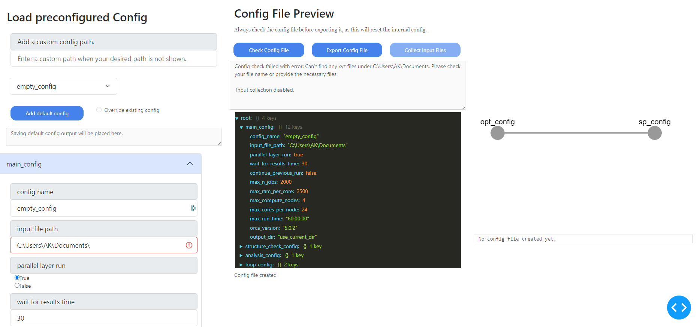
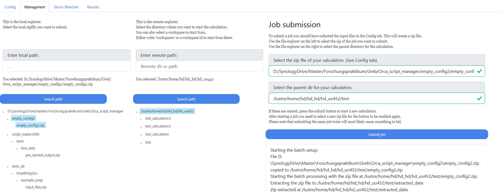
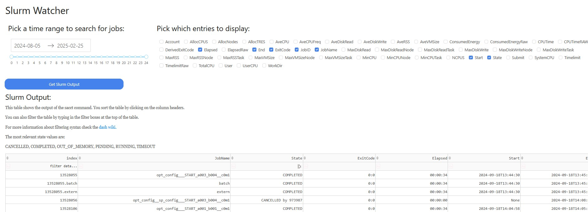
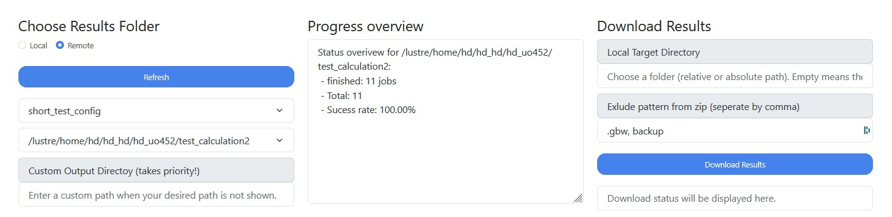
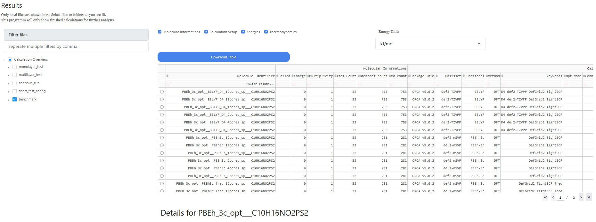
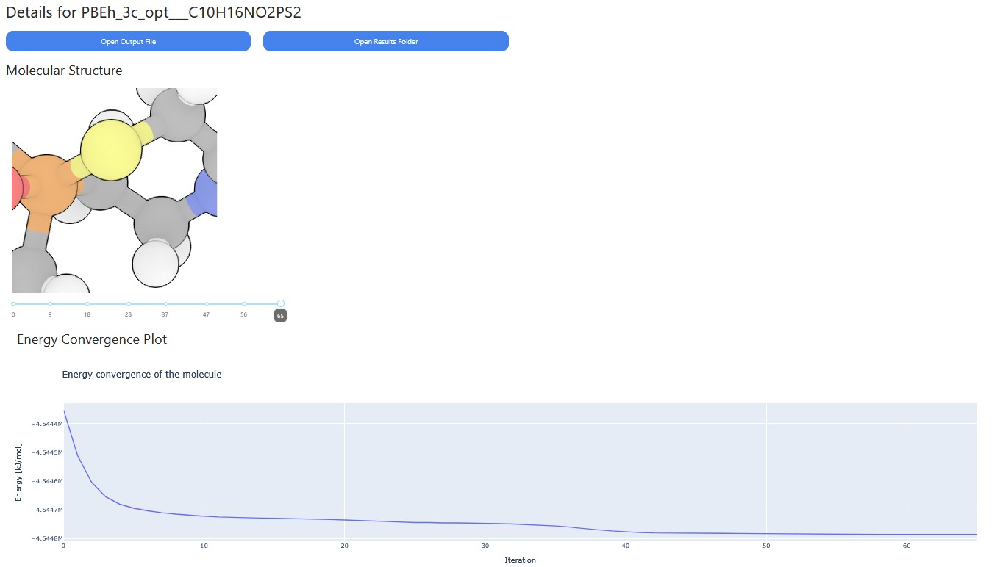

GUI
===

The GUI is a browser based designed to streamline the process of creating config files, submitting and retrieving calculation results as well as handling communications with a remote server.

It will automatically upload and download the necessary files, this circumventing the need for additional tools like scp or rsync.

The main features are structures into four different tabs located at the top left:

Each of these tabs will be discussed in more detail below.

Starting the GUI
----------------

To start the GUI, the user must run the following command from the command line:
``script_maker_cli config-creator --port 8050 --config /path/to/config --hostname my-server.com --username my-username --password "my-password"``

- ``--port`` sets the local port on which the GUI will be hosted. The default is 8050 and as long as no error message indicates that this port is already blocked, this flag can be ignored.

- ``--config`` Allows for a specific config file to be loaded at startup. However this should not really be useful for the user as they are available in a dropdown anyway and is mostly used for debugging purposes.

- ``--hostname`` The hostname of the remote server. This is the address of the server you want your calculations to run on. The default is "justus2.uni-ulm.de" but you could also specify the login node by using "justus2-login01.rz.uni-ulm.de".Choosing one login node as a default would be a good idea as it would allow for a more consistent user experience.

- ``--username`` The username for the remote server. This is the username that you use to log in to the server. If not provided, the user will be prompted for the username.

- ``--password`` The password for the remote server. This is the password that you use to log in to the server. Note that if you add the password directly into the commandline it should be encapsulated like this "password123".If not provided, the user will be prompted for the password.

A recommended command would be to use the following command:
``script_maker_cli config-creator --hostname justus2.uni-ulm.de --username my-username``

Config Creator
--------------

The config creator tab is the first tab and is used to create a new config file. It is the first step in the process of submitting a batch calculation.

At the top left of the tab is a dropdown menu with all the available templates. The user can select a template from the dropdown menu to load the configuration into the editor at the bottom left.

The editor is divided into 4 sections:

1. main_config:
    In this section the config name or label is set. This is the name that will be used to identify the config file in the database.
    It is also important to enter the path to the input file. More information about the input file can be found later on this page.
   
2. structure_check_config:
    Not yet implemented
3. analysis_config:
     Not yet implemented
4. loop_config:
     In this section the actually setup of individual computations is done.

For all entries in the config editor, a hover text provides more information about the entry.

Creating a new config:
----------------------

To create a new config file, the user must first select a template from the dropdown menu. Once a template is selected, the user can edit the configuration in the editor. Once the user is satisfied with the configuration, the user can click the "Save Config" button to save the configuration to the database.

A given config can be added to the template list with the "add default config" button. when overriding an existing emplate check the box next to the button.

Input File
~~~~~~~~~~

The most important part for all xyz input files is that the charge and multiplicity has to be added to the file name with the following syntax:
``__c[charge]m[multiplicity].xyz``

Example: ``H2O__c0m1.xyz``

There are three main options for the input file, though each option can be given with a relative (to where you started the GUI) or absolute path.:
if a valid file has been found a green mark will appear next to the input file path.

1. A single xyz file: This is the most straight forward option and does exactly what it says. 
2. A directory with xyz files: This option will look for all xyz files in the directory and use them as input files. This is the intended usecase of this programm and allows for large batches of calculations to be performed simultaneously.
3. A json file that directs the GUI to the input files: This option is for more advanced users and allows for more control over the input files. The json file should be formatted as follows:
   every key is the name or identifier of a molecule and must contain the sub keys: "path", "key". Additional information like "charge" and "multiplicity" can also be given.

Example json file:

.. code-block:: json

    {
        "H2O": {
            "path": "/some/path/H2O__c0m1.xyz",
            "key": "H2O",
            "charge": 0,
            "multiplicity": 1
        },
        "H2": {
            "path": "/maybe/some/other/path/H2__c0m1.xyz",
            "key": "H2",
            "charge": 0,
            "multiplicity": 1
        }
    }

Creating a calculation pipeline
~~~~~~~~~~~~~~~~~~~~~~~~~~~~~~~

In addition to the ability of submitting many different molecules at once, this program was also designed to submit arbitrary pipelines consisting of different individual calculations.
The simplest example would be to perform a geometry optimization followed by a single point calculation on a higher level of theory.

These pipelines are created in the loop_config section of the config editor.
Note that this description is currently only valid for Orca calculations.

1. Choose the total number of desired steps.
2. Then we set the name for the first calculation step. This name should be unique and descriptive.
3. Select the calculation type, however currently only Orca is supported. Tools such as CREST or AMS are planned for the future which will allow much more complex pipelines.
4. Now we set the step ID, this basically determines the position in the pipeline. The first step should always be 0. 
   To create a branching pipeline we can set multiple steps to the same ID.
5. Choose the method and basis set for the calculation.
6. Add additional  settings that you would normally add in the first line of an orca input file. (Block settings can be set later.)
7. In most cases we can stick with the automated resource allocation. However if we want to use a specific node we can set it here.
   The automated allocation will estimate how many compute cores are optimal based on the number of calculations and the number of nodes available.
   This is important because orca and most other programs do not scale linearly with the number of cores. The more calculations are performed, the more efficient it is to perform them in parallel with fewer cores than to perform them one after the other with many cores.
   This setting takes the ``max_compute_nodes`` setting from the main_config section into account.
8. The last step is to set the initial run time. This is the maximum amount of time that the calculation is allowed to run before it is killed. This setting is important to prevent the calculation from running for too long and blocking the queue for other users.
   A shorter run time will get started faster but might not finish in time. A longer run time will take longer to start but will have a higher chance of finishing.
   If a calculations is stopped by the the walltime limit, it will automatically restarted with the ``max run time`` setting from the main_config section, but this is done only once. 

Now repeat these steps for all desired calculation steps.

Checking the config:
~~~~~~~~~~~~~~~~~~~~~~~

In the middle and right part of the config creator tab, 
you can check the current config and also see a preview of the config file that will be created.

The config save path will determine where the exported config and the input files will be saved to.
The config will be a simple json file and the collected input files will already be zipped and ready for upload in the next section.

Below the buttons you can see what values the automatic resource allocation has chosen for the current config.
The black bar underneath can be expanded to show the entire config file that will be created.

Submitting Jobs
---------------

This tab is used to select which jobs are send to the server and also choose their desired calculation directory.

On the left hand side, the user can specify a path (both unix and windows paths work) and the tree structure underneath will show any valid pre-packaged calculation setups to run.
The same can then be done for the remote directory. Select a target path on the remote machine where the calculations should be saved. 
Please note that each submitted calculation needs to be run in its own directory.

To add a new subdirectory simply add the desired name to the selected calculation path on the right.
Or create the folder on the remote server first. (You may need to search the remote paths again if you do so while the program is running)

After pressing "Submit job" you will get a short summary of what the program is doing and a confirmation if the job was submitted successfully.

Check on running and past jobs
------------------------------

The slurm watcher tab is a quick way to check and filter the status of all jobs that have been submitted to the slurm system.

On the top left the user can select the time frame for which the jobs should be displayed. The default is the current date.
While on the top right the user can select which properties to display for the jobs.

The actual table on the bottom can be sorted and filtered according to the dash conventions. 
For more information about the syntax see the `dash documentation <https://dash.plotly.com/datatable/interactivity>`_.

Retrieving Results
------------------

Download Results
~~~~~~~~~~~~~~~~

The last tab is used to download and display the results of the calculations. 

At the top you can choose which job batch you want to download. 
The dropdown will show all available batches that have been submitted through this program.
On the right you can choose the local directory where the results should be downloaded to.
It is really important that you don't move the data after the download. This program will keep track of its data locations to have them available in the table below, if you move the data manually however this will not work anymore.

Additionally you can exclude certain keywords from the download. By default the backup folder and the .gbw files are excluded as they consume quite a lot of space and bandwidth.

Results Table
~~~~~~~~~~~~~

The table below will show all available results for the selected jobs.

On the left you can select which results to display and on the right you have the actual table as well as some basic control surface for the displayed data and units.
The table itself can be sorted and filtered according to the `dash conventions <https://dash.plotly.com/datatable/interactivity>`_.
Additionally the table can be saved as an excel/csv file.

By clicking the small circle on the left of the table you will see more details for this calculation.

Checking the details
~~~~~~~~~~~~~~~~~~~~

The details page will show all available information for the selected calculation.

For all calculations this view allows you to directly open your file explorer at the location or simply open the output file directly.
The molecular structure will show the 3d molecule and also allow you to scroll through the iterations of the calculation if they are available.
This graph will show you how the structure changed during the optimization.
For geometry optimizations, there will also be an error plot that shows the energy change over the iterations.
For frequency calculations, this pages includes a rough simulated IR spectrum.

