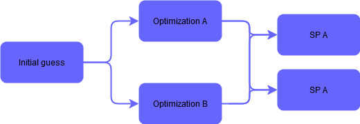
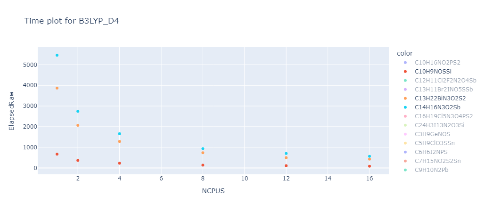

How does this program work?
===========================

Three layers of abstraction
---------------------------

The core of this program is divided into three different layers.
The inner most layer is the **JOB**, the second is the **work_manager** and the outer most layer is the **batch_manager**.

| The **JOB** is the most basic unit of work. It is a single calculation that needs to be done.
 For an orca calculation this would be the desired molecule and the orca input file. 
| Each job can be in different stages depending on its process. 
| These stages go from *initialized* -> *submitted* -> *running* -> *returned* -> *finished*
| Jobs only have information about themselves and their current status.

| The **work_manager** is responsible for managing the jobs. It is the layer that interacts with the calculation module.
 In the beginning each work_manager is given a list of jobs and a single calculation config. (eg. a specific optimization *or* a single point calculation)
 The work manager will create all necessary input files and folders and submit the jobs via *slurm*.
 It then enters a loop to continually check and update the status of the jobs.
| Prepare new jobs -> Submit jobs -> Check submitted jobs -> Manage returned jobs -> Check if all jobs are done -> Wait -> Repeat
| Should new input files appear in its managed directories the new calculation will be initialized and submitted.
 Once all its jobs are finished it will automatically shut off.
| The work_manager only has information about the jobs it is managing and its own calculation config.

The **batch_manager** is the outer most layer and is responsible for managing the *work_managers*.
it is given a list of molecules and a list of calculations as well as the order these calculations are to be performed in.

The example flow chart reads as follows:

The initial guess is optimized according to **Optimization A** and **Optimization B** before both results are advanced to each **SP** Step.
This parallelization allows for a quick and efficient generation of various benchmarks or comparisons.
It is of course also possible to have many more calculations in sequence or parallel.
For example a MM calculation followed by a QM calculation and followed up by a frequency calculation.

Performance considerations
--------------------------

To make this program as efficient as possible the following cost considerations were made:

- Running the actual calculations is the most expensive part of the program. 
  This makes it feasible to have the python script wait for most of its run time and only check occasionally for finished jobs.
  As the jobs will very in their run time it is unlikely that a sufficiently large amount would finish simultaneously to notably affect overall performance.
- The python part of this program is usually run on the login node of the cluster. 
  This node is not designed to run heavy calculations and can be slow to respond to user input.
  To minimize the time spent on the login node, the program is designed to only run the minimum amount of code on the login node.
  This is done by submitting all calculations to the slurm server and then only checking the status of the jobs on the login node.
  This way the login node is only used to check the status of the jobs and submit new jobs.
- To further reduce impact on the login note this program is running sequentially, thus checking all jobs in a loop on a single core and idling for most of its run time.
  This should allow the node to schedule other task in between the checks.

Automatic resource allocation
------------------------------
To further improve efficiency for larger datasets an automatic resource allocation scheme was implemented based on results from a benchmark over multiple molecules and calculation methods.
In this benchmark the same calculations were performed with different number of utilized cores to see if more cores are actually beneficial.

A good representation of the results can be seen in the following graph:

As one can see the overall calculation time decreases with the number of cores used, however the decrease is not linear.
This means that the more cores are used the less efficient the calculation becomes.
This is due to the fact that the calculation is not perfectly parallelizable and the overhead of managing many cores becomes more expensive than the benefit of running the calculation in parallel.

To find the optimal number of cores for a given calculation the program will estimate the time it takes to run the calculation with different number of cores and then choose the number of cores that will finish the calculation the fastest.
This is based on the selected number of nodes these calculations can request from the server and the number of calculations that are currently running on the server.

This way the program will always try to run the calculations as fast as possible without overloading the server with unnecessary calculations.

.. list-table:: Relative performance comparison of different number of cores used for a batch of calculations (lower is better)
  :widths: 50 50
  :header-rows: 0

  * - .. figure:: runtime_2_jobs.png
        :alt: Image 1
        :width: 100%
        :align: center

        2 Jobs
    - .. figure:: runtime_4_jobs.png
        :alt: Image 2
        :width: 100%
        :align: center

        4 Jobs
  * - .. figure:: runtime_10_jobs.png
        :alt: Image 3
        :width: 100%
        :align: center

        10 Jobs
    - .. figure:: runtime_24_jobs.png
        :alt: Image 4
        :width: 100%
        :align: center

        24 Jobs
  * - .. figure:: runtime_48_jobs.png
        :alt: Image 5
        :width: 100%
        :align: center

        48 Jobs
    - .. figure:: runtime_96_jobs.png
        :alt: Image 6
        :width: 100%
        :align: center

        96 Jobs

Local vs Remote operations
--------------------------

This program provides a local interface for configuring settings, collecting necessary files, 
and transferring them to a remote server. 
Once the files are transferred, the program initiates and monitors calculations on the remote server.
After the calculations are completed, the results are extracted and sent back to the local machine. 
The program then presents the results in an organized table for easy analysis and review.

Interface between python and the calculation module
----------------------------------------------------
A core requirement for this program was the ability to seamlessly integrate different calculation tools (eg. Orca, Gaussian, RSA, CREST, etc ).
The difficulty in managing these different tools is that they all have different input and output formats.
To allow for a single work class to manage all these different tools, 
a template class was created from which all calculation tool classes inherit a common interface structure.

This template class provides a few basic functions that the work manager uses to interact with the calculation module.
This allows for basically any computation tool to be used in this library as long as a child class of the template is implemented.

Its main functions are:

- creating the slurm script that will be submitted to the server.
- preparing the jobs that will be submitted to the server.
- checking the status of the jobs that are currently running on the server.
- collecting results from the server and storing them in the correct location.
- submitting new jobs and restarting failed jobs.

All of these functions will depend on the specific calculation tool that is being used.
however this should cover all aspects needed for any calculation tool to be used in this program.