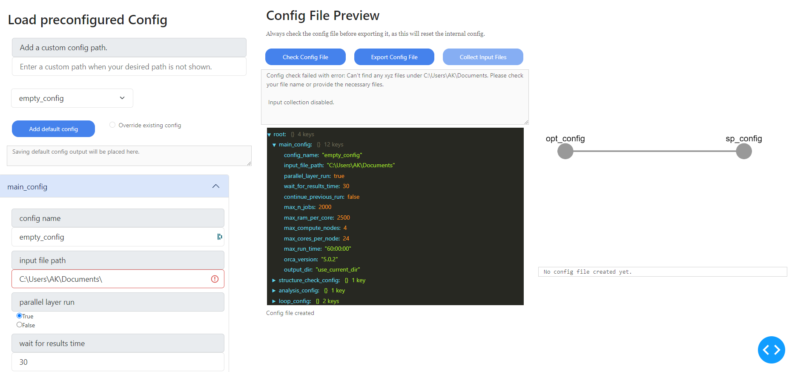

GUI
===

The GUI is a browser based designed to streamline the process of creating config files, submitting and retrieving calculation results as well as handling communications with a remote server.

It will automatically upload and download the necessery files, this circumventing the need for addtional tools like scp or rsync.

The main features are structures into four different tabs located at the top left:

Each of these tabs will be discussed in more detail below.

Config Creator
--------------

The config creator tab is the first tab and is used to create a new config file. It is the first step in the process of submitting a batch calculation.

At the top left of the tab is a dropdown menu with all the available templates. The user can select a template from the dropdown menu to load the configuration into the editor t the bottom left.

The editor is divided into 4 sections:

1. main_config:
    In this section the config name or label is set. This is the name that will be used to identify the config file in the database.
    Also important is to set the path to the input file. More infomaton about the inpu file can be found later on this page.
   
2. structure_check_config:
    Not yet implemented
3. analysis_config:
     Not yet implemented
4. loop_config:
     This one is where one can acutally setup the individual computations.

For all entries in the conig editor there is hover text that will provide more information about the entry.

creating a new config:
----------------------

To create a new config file, the user must first select a template from the dropdown menu. Once a template is selected, the user can edit the configuration in the editor. Once the user is satisfied with the configuration, the user can click the "Save Config" button to save the configuration to the database.

A given config can be added to the template list with the "add default config" button. when overriding an existing emplate check the box next to the button.

Input File
~~~~~~~~~~

The most important part for all xyz input files is that the charge and multiplicity has to be added to the file name with the following syntax:
``__c[charge]m[multiplicity].xyz``

Example: ``H2O__c0m1.xyz``

There are three main options for the input file, though each option can be given with a relative (to where you started the GUI) or absolute path.:
if a valid file has been found a green mark will apear next to the input file path.

1. A single xyz file: This is the most straight forward option and does exactly what it says. 
2. A directory with xyz files: This option will look for all xyz files in the directory and use them as input files. This is the intended usecase of this programm and allows for large batches of calculations to be performed simultaneously.
3. A json file that directs the GUI to the input files: This option is for more advanced users and allows for more control over the input files. The json file should be formatted as follows:
   every key is the name or identifier of a molecule and must contain the sub keys: "path", "key". Additional information like "charge" and "multiplicity" can also be given.

Example json file:

.. code-block:: json

    {
        "H2O": {
            "path": "/some/path/H2O__c0m1.xyz",
            "key": "H2O",
            "charge": 0,
            "multiplicity": 1
        },
        "H2": {
            "path": "/maybe/some/other/path/H2__c0m1.xyz",
            "key": "H2",
            "charge": 0,
            "multiplicity": 1
        }
    }

Creating a calculation pipeline
~~~~~~~~~~~~~~~~~~~~~~~~~~~~~~~

In addition to the abiliy of submiting many different molecules at once this program was also designed to submit arbitrary pipelines consisting of different individual calculations.
The simplest example would be to perform a geometry optimization followed by a frequency calculation with different methods or basissets.

These pipelines are created in the loop_config section of the config editor.
Note that this description is currently only valid for Orca calculations.

1. Choose the total number of desired steps.
2. Then we set the name for the first calculation step. This name should be unique and descriptive.
3. Select the calculation type, however currently only Orca is supported. Tools like crestor solvent corrections are planned for the future an will allow for much more complex pipelines.
4. Now we set the step ID, this basically determines the position in the pipeline. The first step should always be 0. 
   To create a branching pipeline we can set multiple steps to the same ID.
5. Choose the method and basis set for the calculation.
6. Add additinal settings that you woud normally add in the first line of an orca input file. (Block settings can be set later.)
7. In most cases we can stick ith the automated resource allocation. However if we want to use a specific node we can set it here.
   The automated allocation will estimate how many compute cores are optiomal based on the number of calculations and the number of nodes available.
   This is important because orca and most other programs do not scale linearly with the number of cores. The more calculations are done the more efficient it is to perform them in parallel with fewer compares compared to running them in sequence with many cores.
   This setting takes the ``max_compute_nodes`` setting from the main_config section into account.
8. The last step is to set the initial run time. This is the time that the calculation is allowed to run before it is killed. This is important to prevent the calculation from running for too long and blocking the queue for other users.
   A shorter run time will get started faster but might not finish in time. A longer run time will take longer to start but will have a higher chance of finishing.
   If a calculations runs into the walltime it will automatically restarted with the ``max run time`` setting from the main_config section, but this is done only once. 

Now repeat these steps for all desired calculation steps.
